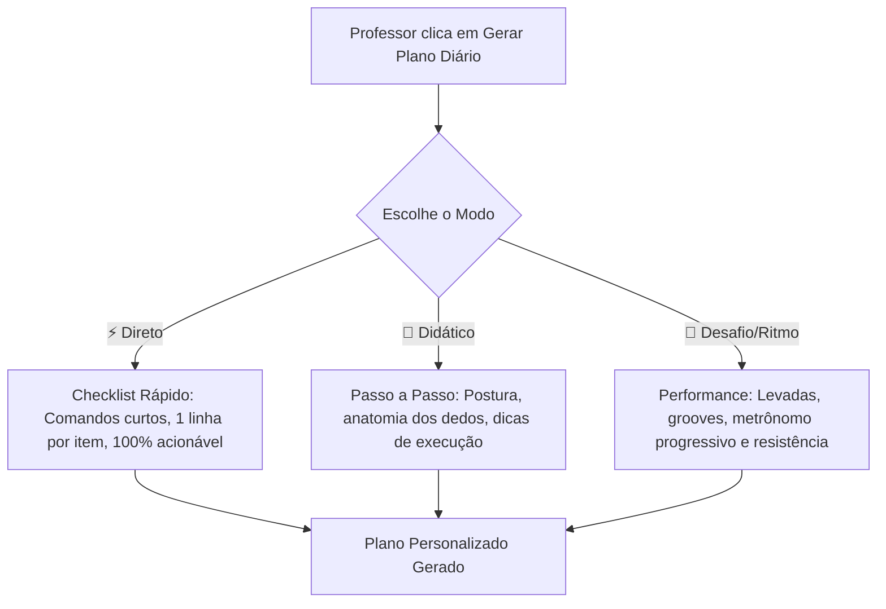

# PRD — 3 Modos de Geração de Planos Diários com IA (MusicPro AI)

## 1. Visão Geral

### Problema
Cada aluno e professor possui um perfil de aprendizado e uma necessidade diferente:
- Alguns querem apenas uma **lista rápida de exercícios (checklist)** para praticar em 15 minutos sem ler textos longos;
- Outros precisam de uma **orientação didática detalhada**, com dicas de postura, dedos e correção de erros;
- Outros preferem um foco em **levadas, ritmo, desafios práticos e repertório musical**.

Hoje o sistema possui um modelo único e rígido. Ao oferecer múltiplos modos, o professor tem total controle sobre o estilo pedagógico entregue a cada aluno.

### Objetivo
Implementar **3 Modos de Geração de Plano Diário com IA**, selecionáveis pelo professor antes de clicar em "Gerar Plano Diário":
1. ⚡ **Modo 1: Direto & Prático (Checklist de Treino)** — Frases curtas de 1 linha, comandos diretos, BPM e repetições, zero enrolação.
2. 📖 **Modo 2: Didático & Detalhado (Passo a Passo Guiado)** — Explicação rica de postura, anatomia dos movimentos, o que observar em cada nota e correção de erros.
3. 🎸 **Modo 3: Desafio & Ritmo (Levadas e Performance)** — Foco em grooves, levadas rítmicas aplicadas, treinos de velocidade/resistência e tocar em loop.

### Contexto
- **Backend:** `server/routers/progressRouters.ts` (`generateDailyStudyPlan`).
- **Frontend:** `client/src/pages/Progresso.tsx` (Card de geração do plano com seletor de estilo).

---

## 2. Especificação dos 3 Modos de Geração

---

### ⚡ Modo 1: Direto & Prático (Checklist de Treino) — *Recomendado para o dia a dia*
* **Tom de Voz:** Direto, enxuto, imperativo, estilo ficha de academia.
* **Tamanho dos Itens:** Máximo de 1 linha por ponto (10 a 15 palavras).
* **Estrutura:**
  - *Aquecimento:* 2 linhas de ação rápida.
  - *Prática:* 3 linhas diretas (Posição dos dedos → Repetições no metrônomo → Aplicação da meta).
  - *Desafio:* 1 meta com contagem clara de acertos.
* **Exemplo:**
  > • **Mão direita:** Dedos 1(D), 3(F#) e 5(A).  
  > • **Metrônomo:** Toque 10x a 60 BPM contando 1, 2, 3, 4.  
  > • **Mão esquerda:** Toque a nota D no baixo no tempo 1.  
  > • **Desafio:** Tocar 1 minuto sem errar nenhuma nota.

---

### 📖 Modo 2: Didático & Detalhado (Passo a Passo Guiado)
* **Tom de Voz:** Professor particular atencioso, acolhedor e focado na mecânica perfeita.
* **Tamanho dos Itens:** Explicações completas sobre o "como fazer" e o "porquê".
* **Estrutura:**
  - *Aquecimento:* Preparação muscular, postura de ombros/pulsos e respiração.
  - *Prática:* Posicionamento anatômico dos dedos, teste de clareza nota por nota, como corrigir som abafado e dicas de relaxamento.
  - *Desafio:* Teste de precisão com critério de qualidade sonora e dinâmica.
* **Exemplo:**
  > • **Posicionamento:** Monte a tríade de Ré maior usando o polegar (D), médio (F#) e mínimo (A). Mantenha os dedos curvados como se segurasse uma bolinha de tênis.  
  > • **Teste de Clareza:** Toque tecla por tecla lentamente. Se a tecla F# soar opaca, certifique-se de que a falange do dedo médio não está esbarrando na tecla Sol.  
  > • **Desafio de Postura:** Execute o acorde a 60 BPM prestando atenção no relaxamento dos ombros e sem tensionar o punho.

---

### 🎸 Modo 3: Desafio & Ritmo (Levadas e Performance)
* **Tom de Voz:** Dinâmico, energético, focado em ritmo, groove e resistência muscular.
* **Tamanho dos Itens:** Instruções focadas em andamento (BPM), padrões rítmicos e aplicação musical.
* **Estrutura:**
  - *Aquecimento:* Destreza rítmica e independência de mãos/dedos.
  - *Prática:* Levadas rítmicas (ex: Pop 4/4, Balada 6/8, Dedilhados), trocas em tempo real no metrônomo e aceleração progressiva.
  - *Desafio:* Tocar a progressão em loop por 2 minutos contínuos sem parar o tempo.
* **Exemplo:**
  > • **Levada Pop 4/4:** Toque o acorde nos tempos 1, 2, 3 e 4 enquanto a mão esquerda sustenta o baixo na semibreve.  
  > • **Aceleração Gradual:** Comece a troca D ↔ C a 60 BPM por 2 compassos, suba para 75 BPM e finalize a 90 BPM.  
  > • **Desafio de Resistência:** 16 compassos contínuos na levada pop sem hesitação na troca.

---

## 3. Experiência de Usuário (UX/UI no Frontend)

No modal / card de **Gerar Plano Diário** em `Progresso.tsx`:
1. **Seletor de Modo Visual:**
   - 3 botões estilizados (estilo Tabs/Cards selecionáveis) com ícone e descrição rápida:
     - ⚡ **Direto** (Checklist rápido e objetivo)
     - 📖 **Didático** (Passo a passo com dicas de postura)
     - 🎸 **Ritmo & Desafio** (Levadas, metrônomo e grooves)
2. **Tempo Diário:** Mantém o seletor (15 min, 30 min, 45 min).
3. **Observação do Professor:** Campo opcional mantido.
4. **Botão de Ação:** *"Gerar Plano Diário (Modo Selecionado)"*.

---

## 4. Requisitos Funcionais

### RF-001 — Campo `planMode` na API tRPC
- **Entrada:** `planMode: z.enum(["direto", "didatico", "desafio"]).default("direto")`.
- **Comportamento:** O backend seleciona a diretriz de tom, tamanho de frase e metodologia correspondente no prompt da IA.

### RF-002 — Persistência e Rastreabilidade
- O modo utilizado na geração é salvo junto ao JSON do plano em `daily_study_plans` para histórico.

### RF-003 — Formatação no WhatsApp
- O formatador `formatPlanAsText` respeita o estilo do modo escolhido, mantendo o formato perfeito tanto para o checklist curto quanto para o didático.

---

## 5. Critérios de Aceite

* [x] **CA-001:** O professor pode alternar facilmente entre os 3 modos na interface antes de gerar o plano.
* [x] **CA-002:** O Modo "Direto" gera tópicos curtos de 1 linha sem parágrafos explicativos longos.
* [x] **CA-003:** O Modo "Didático" gera instruções detalhadas com foco em postura e anatomia.
* [x] **CA-004:** O Modo "Desafio" gera levadas rítmicas e metas de BPM progressivo.
* [x] **CA-005:** Todos os 3 modos continuam 100% fiéis às metas cadastradas do aluno e sem menção a nomes próprios.
